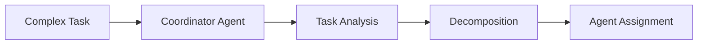

# Multi-Agent MCP Ensemble Architecture

This document outlines the design and implementation of a distributed multi-agent system where multiple AI agents interact with each other and various MCP (Model Context Protocol) servers to collaboratively solve complex tasks.

## System Overview

The ensemble consists of:
- **Agent Network**: Multiple specialized AI agents with different capabilities
- **MCP Server Farm**: Various MCP servers providing tools and data access
- **Orchestration Layer**: Coordination system for task distribution and communication
- **Communication Bus**: Message passing system between all components

## Architecture Components

### Agent Types

#### Coordinator Agent
- **Role**: Task decomposition, delegation, and result synthesis
- **Capabilities**: 
  - Parse complex tasks into subtasks
  - Route work to appropriate specialist agents
  - Aggregate results from multiple agents
  - Handle conflict resolution between agents

#### Specialist Agents
- **Code Agent**: Programming, debugging, refactoring
- **Research Agent**: Information gathering, web search, documentation analysis
- **Analysis Agent**: Data analysis, pattern recognition, reporting
- **Testing Agent**: Test creation, validation, quality assurance
- **DevOps Agent**: Deployment, monitoring, infrastructure management

#### Worker Agents
- **File Agent**: File system operations, content management
- **Database Agent**: Data persistence, queries, migrations
- **API Agent**: External service integration, HTTP requests
- **Security Agent**: Vulnerability scanning, compliance checking

### MCP Server Categories

#### Data Servers
- **Database MCP**: PostgreSQL, MongoDB, Redis connections
- **File System MCP**: Local and cloud file operations
- **API Gateway MCP**: External service integrations
- **Cache MCP**: Distributed caching layer

#### Development Servers
- **Git MCP**: Version control operations
- **CI/CD MCP**: Build and deployment pipelines
- **Testing MCP**: Test execution and reporting
- **Code Analysis MCP**: Static analysis, linting, formatting

#### Infrastructure Servers
- **Cloud MCP**: AWS, GCP, Azure resource management
- **Container MCP**: Docker, Kubernetes operations
- **Monitoring MCP**: Metrics, logging, alerting
- **Security MCP**: Scanning, compliance, secrets management

## Communication Patterns

### Agent-to-Agent Communication
```
Coordinator Agent
├── broadcasts task to specialist agents
├── receives progress updates
└── synthesizes final results

Specialist Agents
├── request data from worker agents
├── share intermediate results
└── collaborate on complex problems
```

### Agent-to-MCP Communication
```
Agent → MCP Server
├── Tool invocation requests
├── Data queries
└── Status checks

MCP Server → Agent
├── Tool execution results
├── Data responses
└── Error notifications
```

### Cross-Communication Flows
- **Peer Discovery**: Agents discover available peers and their capabilities
- **Load Balancing**: Work distribution based on agent availability and expertise
- **Fault Tolerance**: Automatic failover when agents or MCP servers become unavailable
- **Result Caching**: Shared cache to avoid duplicate work across agents

## Task Execution Workflow

### 1. Task Ingestion


### 2. Parallel Execution
- Multiple agents work simultaneously on different subtasks
- Real-time progress sharing and dependency management
- Dynamic task reallocation based on agent performance

### 3. Result Synthesis
- Coordinator collects partial results
- Validates consistency across agent outputs
- Merges results into final deliverable

## Implementation Strategies

### Agent Discovery and Registration
```javascript
// Pseudo-code for agent registration
const agentRegistry = {
  register: (agent) => {
    // Register agent capabilities and endpoints
    registry.add(agent.id, agent.capabilities);
  },
  discover: (capability) => {
    // Find agents with specific capabilities
    return registry.findByCapability(capability);
  }
};
```

### MCP Server Pool Management
```javascript
// MCP server connection pool
const mcpPool = {
  servers: new Map(),
  connect: (serverConfig) => {
    // Establish MCP connections
    const client = new MCPClient(serverConfig);
    servers.set(serverConfig.id, client);
  },
  getServer: (capability) => {
    // Route requests to appropriate MCP server
    return servers.get(findServerByCapability(capability));
  }
};
```

### Message Bus Architecture
- **Event-Driven**: Agents publish/subscribe to task events
- **Async Communication**: Non-blocking message passing
- **Persistent Queue**: Message durability and retry mechanisms
- **Priority Routing**: Critical tasks get priority handling

## Scaling Considerations

### Horizontal Scaling
- **Agent Pools**: Multiple instances of each agent type
- **MCP Server Clusters**: Load-balanced MCP server groups
- **Sharding**: Distribute tasks across agent clusters by domain

### Vertical Scaling
- **Resource Allocation**: Dynamic CPU/memory allocation per agent
- **Context Management**: Efficient context sharing between agents
- **Caching Strategies**: Multi-level caching for frequently used data

## Monitoring and Observability

### Metrics to Track
- Agent utilization and performance
- MCP server response times and availability
- Task completion rates and success metrics
- Inter-agent communication patterns

### Health Checks
- Agent heartbeat monitoring
- MCP server connectivity status
- Message queue health and backlog
- Resource usage alerts

## Security Considerations

### Authentication & Authorization
- **Agent Identity**: Secure agent-to-agent authentication
- **MCP Access Control**: Permission-based tool access
- **Secret Management**: Centralized secret distribution

### Network Security
- **Encrypted Communication**: TLS for all inter-component communication
- **Network Isolation**: Containerized environments for each agent
- **Audit Logging**: Complete audit trail of all agent actions

## Example Use Cases

### Software Development Project
1. **Coordinator** receives "Build a web application" task
2. **Research Agent** analyzes requirements and finds relevant documentation
3. **Code Agent** implements backend API using Database MCP
4. **Testing Agent** creates tests using Testing MCP
5. **DevOps Agent** deploys using Cloud MCP and CI/CD MCP
6. **Security Agent** scans for vulnerabilities using Security MCP

### Data Analysis Pipeline
1. **Coordinator** processes "Analyze customer data" request
2. **Database Agent** extracts data using Database MCP
3. **Analysis Agent** processes data using specialized analysis tools
4. **Research Agent** finds relevant market data via API MCP
5. **File Agent** generates reports using File System MCP

## Getting Started

### Prerequisites
- MCP-compatible AI framework
- Message queue system (RabbitMQ, Apache Kafka)
- Container orchestration platform (Docker, Kubernetes)
- Service discovery system (Consul, etcd)

### Basic Setup
1. Deploy MCP servers for required capabilities
2. Initialize agent pools with different specializations
3. Configure message bus and service discovery
4. Set up monitoring and logging infrastructure
5. Deploy coordinator agent with task routing logic

### Configuration Example
```yaml
ensemble:
  agents:
    coordinator:
      replicas: 1
      resources: { cpu: 2, memory: 4Gi }
    specialists:
      - type: code
        replicas: 3
        resources: { cpu: 4, memory: 8Gi }
      - type: research
        replicas: 2
        resources: { cpu: 2, memory: 4Gi }
  
  mcp_servers:
    - type: database
      endpoint: postgresql://...
      tools: [query, migrate, backup]
    - type: git
      endpoint: github://...
      tools: [clone, commit, push, pr]
```

This multi-agent ensemble architecture enables scalable, collaborative AI systems that can tackle complex, multi-faceted tasks by leveraging specialized agents and diverse tool capabilities through MCP servers.